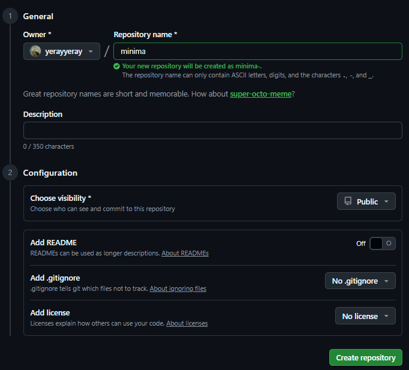
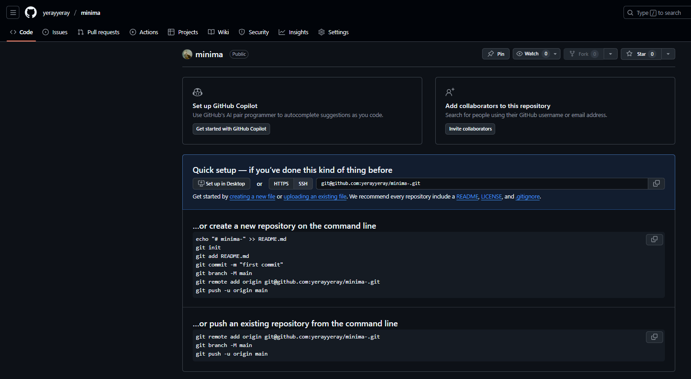
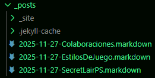
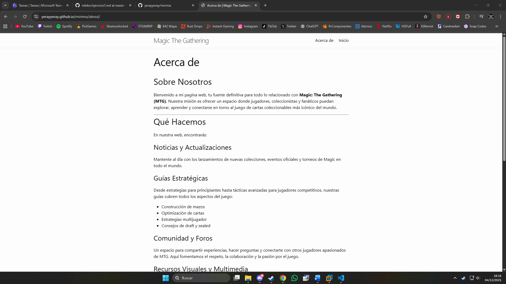
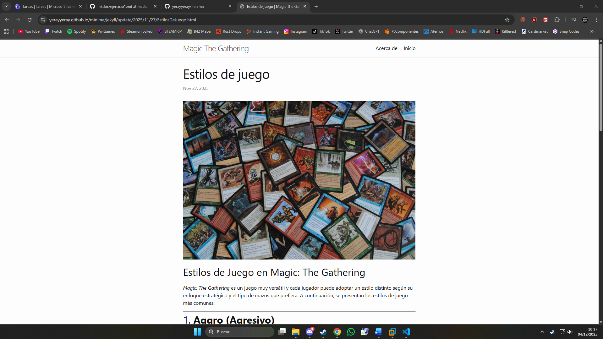
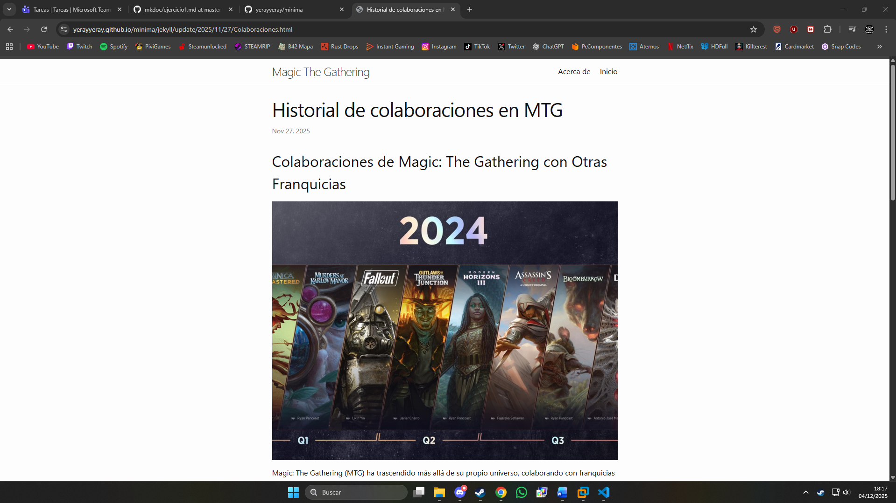

# Ejercicio 1: Creación de un sitio web en Jekyll con el tema Minima
## 1. Actualizar Debian 13
Antes de nada, hay que actualizar debian para que no esté desactualizado:

`sudo apt update && sudo apt upgrade -y`

## 2. Instalación de Ruby y Jekyll
### Ruby:
Instalar Ruby y los paquetes necesarios:

`sudo apt install ruby-full build-essential zlib1g-dev -y`

Añadir al .bashrc la variable de entorno GEM_HOME para que las gemas se instalen en ~/gems:

`echo 'export GEM_HOME="$HOME/gems"' >> ~/.bashrc`

Añadir al .bashrc una línea que incluya el directorio de binarios de gemas en el PATH:

`echo 'export PATH="$HOME/gems/bin:$PATH"' >> ~/.bashrc`

Recarga el archivo .bashrc para aplicar los cambios:

`source ~/.bashrc`

### Jekyll:

Instalar las gemas jekyll y bundler en tu sistema:

`gem install jekyll bundler`

## 3. Crear el sitio:
### Crear el sitio en jekyll:

Crear un nuevo sitio Jekyll llamado minima con la estructura básica inicial:

`jekyll new minima`

## 4. Crear el repositorio en git:

Primero hay que crear el repositorio en local con Git mediante los comandos:

```
git init
git remote add origin "https://github.com/yerayyeray/minima.git"
```

Ahora hay que crear el repositorio en GitHub:






## 5. Configuración del sitio:
Iniciar el servidor local de Jekyll usando las dependencias del proyecto y lo hace accesible desde mi maquina fisica a traves de la url http://localhost:4000 y poder observar los cambios que se hagan en el sitio para que esté listo antes de subirlo a mir repositorio de github:

`bundle exec jekyll serve --host 0.0.0.0`

### Modificar el archivo de configuración del sitio:
El archivo `_config.yml` sirve para definir la configuración global de tu sitio Jekyll, como título, tema, URL y ajustes generales y para personalizar el sitio con nuestros datos, hay que rellenar los campos con nuestros datos


### Modificar la pantalla de inicio  del sitio:
Para modificar el la pagina principal del sitio, hay que modificar el archivo `index.markdown` con la estructura e información del sitio web que se quiere crear


### Modificar la pagina de "Acerca de" en el sitio:
La pagina de "Acerca de" se pude modificar en el archivo `about.markdown` en el que hay que poner información sobre lo que se va a encontrar en el sitio web o sobre su autor etc.


### Añadir los posts al sitio:
Para crear los posts de este blog, hay que ir a la carpeta `/_posts`



Crear archivos de markdown con el formato de nombre `año-mes-dia-nombre_del_post`, como por ejemplo en mi caso `2025-11-27-Colaboraciones.markdown` y los post tendran que tener una estructura como esta:


## 6. Subir el sitio a GitHub Pages:
Hay que subir el repositorio primero hay que hacer los commits de todos los cambios que se han hecho en el repositorio si no se han hecho con los comandos:

```
git add .
git commit -m "comentario"
```

Si se quiere subir directamente a GitHub Pages se puede hacer subiendolo al remoto desde la rama gh-pages, la cual se puede crear así:
> git checkout -b gh-pages

Si no se hace así, se puede hacer desde la interfaz de GitHub desde aquí:


Despues, se hara el push con el comando:

`git push origin gh-pages`

## 7. Sitio web subido en GitHub Pages:
La url de la pagina es esta:

https://yerayyeray.github.io/minima/

Este es el aspecto que tiene el sitio web ya subido en GitHub Pages:

Inicio:


Acerca de:



Posts:





